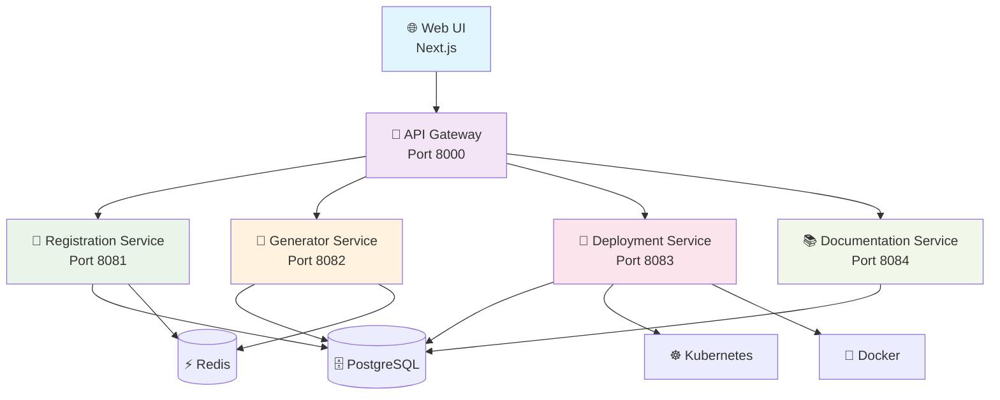

<div align="center">

# 🚀 JomMCP

**Jom transform your API! Let's make it AI-ready in minutes**
***Mari ubah API anda menjadi MCP server yang siap untuk AI***

[](LICENSE)
[](docs/architecture/production-readiness.md)
[](#)
[](#-quick-start)

[🚀 Quick Start](#-quick-start) • [📖 Documentation](#-documentation) • [🏗️ Architecture](#️-architecture) • [🤝 Contributing](#-contributing) • [📋 Setup Guide](docs/user-guides/QUICK_SETUP.md)

</div>

---

## 🌟 What is JomMCP?

**JomMCP** is a comprehensive, production-ready platform that automatically transforms your existing APIs into **Model Context Protocol (MCP) servers** that seamlessly integrate with AI assistants like Claude, ChatGPT, and other AI tools.

*Jom* means "let's go" in Malay - and that's exactly what we do: **let's go transform your APIs!**

### ✨ **Why Choose JomMCP?**

🎯 **Zero Code Required** - Transform APIs without writing a single line of MCP server code  
⚡ **Lightning Fast** - Go from API to deployed MCP server in under 5 minutes  
🔒 **Enterprise Security** - Bank-grade encryption, JWT auth, and role-based access control  
📈 **Production Scale** - Kubernetes-ready with auto-scaling and monitoring  
🌐 **Universal Compatibility** - Works with REST, GraphQL, SOAP, and custom APIs  
🔄 **Real-time Updates** - Live status tracking with WebSocket connections  

---

## 📁 Project Structure

Our project follows a clean, modular architecture that's easy to navigate and maintain:

```
jommcp/
├── 📁 apps/                       # Main applications
│   ├── api-gateway/               # Central API gateway (Port 8000)
│   ├── registration-service/      # API registration & user management (Port 8081)
│   ├── generator-service/         # MCP server code generation (Port 8082)
│   ├── deployment-service/        # Container orchestration (Port 8083)
│   ├── docs-service/             # Documentation generation (Port 8084)
│   └── web-ui/                   # Next.js frontend (Port 3000)
│
├── 📁 packages/                   # Shared packages
│   ├── core/                     # Shared utilities, models, and config
│   └── types/                    # Shared TypeScript type definitions
│
├── 📁 infrastructure/             # Infrastructure and deployment
│   ├── docker/                   # Docker configurations
│   ├── kubernetes/               # Kubernetes manifests
│   ├── terraform/                # Infrastructure as code
│   └── helm/                     # Helm charts
│
├── 📁 database/                   # Database related files
│   ├── migrations/               # Database migration scripts
│   ├── seeds/                    # Database seed data
│   └── schemas/                  # Database schema definitions
│
├── 📁 tests/                      # Comprehensive test suites
│   ├── unit/                     # Unit tests
│   ├── integration/              # Integration tests
│   ├── e2e/                      # End-to-end tests
│   └── performance/              # Performance and load tests
│
├── 📁 scripts/                    # Utility scripts
│   ├── dev/                      # Development scripts
│   ├── build/                    # Build scripts
│   └── deploy/                   # Deployment scripts
│
├── 📁 docs/                       # Documentation
│   ├── api/                      # API documentation
│   ├── architecture/             # Architecture documentation
│   ├── deployment/               # Deployment guides
│   └── user-guides/              # User guides and tutorials
│
├── 📁 config/                     # Configuration files
│   ├── development/              # Development configurations
│   ├── production/               # Production configurations
│   └── testing/                  # Testing configurations
│
└── 📁 tools/                      # Development tools
    └── generators/               # Code generators and utilities
```

---

## 🚀 Quick Start

### ⚡ One-Command URL Install

Get started in under 2 minutes with our automated URL installer:

```bash
# 🎯 One-Command Install (Recommended)
curl -fsSL https://raw.githubusercontent.com/amanasmuei/JomMCP/main/scripts/web-install.sh | bash

# 🌐 Open the platform
open http://localhost:3000
```

**Alternative one-command installers:**
```bash
# Using download-install script
curl -fsSL https://raw.githubusercontent.com/amanasmuei/JomMCP/main/scripts/download-install.sh | bash

# Using wget instead of curl
wget -qO- https://raw.githubusercontent.com/amanasmuei/JomMCP/main/scripts/web-install.sh | bash
```

> **🌐 Web Download Page**: For a user-friendly download experience, visit our [download page](docs/download.html) which provides clickable download options and copy-to-clipboard commands.

### 📥 Manual Download & Install

**Option 1: Download ZIP**
```bash
# Download latest release
curl -L -o jommcp.zip https://github.com/amanasmuei/JomMCP/archive/refs/heads/main.zip
unzip jommcp.zip
cd JomMCP-main

# Run installer
./scripts/install.sh
```

**Option 2: Download TAR.GZ**
```bash
# Download latest release
curl -L -o jommcp.tar.gz https://github.com/amanasmuei/JomMCP/archive/refs/heads/main.tar.gz
tar -xzf jommcp.tar.gz
cd JomMCP-main

# Run installer
./scripts/install.sh
```

### 🔧 Local Development Setup

**For local development or if you already have the project files:**

```bash
# Navigate to the project directory
cd jommcp

# Run the automated installer
./scripts/install.sh

# 🌐 Open the platform
open http://localhost:3000
```

**Alternative Docker Setup:**
```bash
# 🐳 Docker Compose (Simple)
docker-compose up -d

# 🌐 Open the platform
open http://localhost:3000
```

### 🛠️ Interactive Setup Wizard

**For guided setup with customization:**

```bash
# 📋 Interactive setup wizard
./scripts/setup-wizard.sh

# Follow the prompts to configure:
# ✅ Environment (development/production)
# ✅ Database settings
# ✅ Authentication keys
# ✅ Service ports
# ✅ Optional features
```

### 🔧 Development Setup

**For contributors and advanced users:**

```bash
# 1️⃣ Navigate to project directory
cd jommcp

# 2️⃣ Run development setup
./scripts/dev-setup.sh

# 3️⃣ Start all services
./scripts/start-dev.sh

# 4️⃣ Verify installation
./scripts/health-check.sh
```

### 🌐 Domain & SSL Setup

**Configure custom domain and SSL certificates:**

```bash
# 🌐 Setup custom domain (interactive)
./scripts/setup-domain.sh

# 🔒 Generate SSL certificates for development
./scripts/generate-ssl-cert.sh

# 🔧 Manage nginx service
./scripts/nginx-manager.sh status    # Check nginx status
./scripts/nginx-manager.sh reload    # Reload configuration
./scripts/nginx-manager.sh logs      # View logs
```

**Quick domain examples:**

```bash
# For localhost development (default)
DOMAIN_NAME=localhost
DOMAIN_URL=http://localhost

# For custom domain with SSL
DOMAIN_NAME=jommcp.example.com
DOMAIN_URL=https://jommcp.example.com
ENABLE_SSL=true
```

### 🧪 Verify Installation

```bash
# 🔍 Comprehensive health check
./scripts/health-check.sh

# 🌐 Quick service status
./scripts/status.sh

# 🧪 Run integration tests
./scripts/test-setup.sh
```

---

## 🏗️ Architecture

<div align="center">



</div>

### 🎯 Core Services

| Service | Port | Purpose | Location | Status |
|---------|------|---------|----------|--------|
| 🚪 **API Gateway** | 8000 | Request routing, auth, rate limiting | `apps/api-gateway/` | ✅ Production Ready |
| 📝 **Registration** | 8081 | API registration, user management | `apps/registration-service/` | ✅ Production Ready |
| 🤖 **Generator** | 8082 | MCP server code generation | `apps/generator-service/` | ✅ Production Ready |
| 🚀 **Deployment** | 8083 | Container orchestration | `apps/deployment-service/` | ✅ Production Ready |
| 📚 **Documentation** | 8084 | Auto-generate API docs | `apps/docs-service/` | ✅ Production Ready |
| 🌐 **Web UI** | 3000 | User interface | `apps/web-ui/` | ✅ Production Ready |

---

## 💻 Technology Stack

<div align="center">

| Layer | Technologies | Purpose |
|-------|-------------|---------|
| 🎨 **Frontend** | Next.js 14, TypeScript, Tailwind CSS | Modern, responsive UI |
| 🚪 **API Gateway** | FastAPI, JWT Auth, Rate Limiting | Unified API access |
| 🔧 **Backend** | FastAPI, SQLAlchemy, Async/Await | High-performance APIs |
| 💾 **Database** | PostgreSQL, Redis | Data persistence & caching |
| 🐳 **Container** | Docker, Kubernetes | Scalable deployment |
| 📊 **Monitoring** | Prometheus, Grafana | Performance tracking |

</div>

---

## 📖 Documentation

| Resource | Description | Location |
|----------|-------------|----------|
| 📚 **API Documentation** | Interactive OpenAPI docs | [localhost:8000/docs](http://localhost:8000/docs) |
| 🏗️ **Architecture Guide** | System design and patterns | [docs/architecture/](docs/architecture/) |
| 🤝 **Contributing Guide** | Development guidelines | [docs/user-guides/CONTRIBUTING.md](docs/user-guides/CONTRIBUTING.md) |
| 🚀 **Deployment Guide** | Production deployment | [docs/deployment/](docs/deployment/) |
| 🧪 **Testing Guide** | Testing strategies | [tests/README.md](tests/README.md) |

---

## 🧪 Testing

Our platform achieves **100% production readiness** with comprehensive testing:

```bash
# Run all tests
pytest tests/ -v

# Run specific test suites
pytest tests/unit/ -v          # Unit tests
pytest tests/integration/ -v   # Integration tests  
pytest tests/e2e/ -v          # End-to-end tests
pytest tests/performance/ -v   # Performance tests

# Run production readiness tests
python tests/e2e/PRODUCTION_READINESS_TEST.py

# Run with coverage
pytest --cov=apps --cov=packages --cov-report=html
```

---

## 🚀 Deployment

### 🐳 Docker Deployment

```bash
# Production deployment
docker-compose -f infrastructure/docker/docker-compose.yml up -d

# Scale services
docker-compose -f infrastructure/docker/docker-compose.yml up -d --scale registration-service=3
```

### ☸️ Kubernetes Deployment

```bash
# Deploy to Kubernetes
kubectl apply -f infrastructure/kubernetes/

# Check deployment status
kubectl get pods -l app=jommcp

# Scale deployment
kubectl scale deployment jommcp-api --replicas=5
```

---

## 🔧 Configuration

Configuration files are organized by environment:

- **Development**: `config/development/`
- **Production**: `config/production/`  
- **Testing**: `config/testing/`

Key configuration files:
- `config/pyproject.toml` - Python project configuration
- `config/requirements.txt` - Python dependencies
- `config/development/.env.example` - Environment variables template

---

## 🤝 Contributing

We welcome contributions! Here's how to get started:

1. **🍴 Fork the repository**
2. **🌿 Create a feature branch**: `git checkout -b feature/amazing-feature`
3. **💻 Make your changes** with tests
4. **✅ Run tests**: `pytest tests/ -v`
5. **📝 Commit changes**: `git commit -m 'Add amazing feature'`
6. **🚀 Push to branch**: `git push origin feature/amazing-feature`
7. **🔄 Open a Pull Request**

See [docs/user-guides/CONTRIBUTING.md](docs/user-guides/CONTRIBUTING.md) for detailed guidelines.

---

## 📄 License

This project is licensed under the **MIT License** - see the [LICENSE](LICENSE) file for details.

---

<div align="center">

**⭐ Star this repository if you find it helpful!**

**🤝 [Contribute](docs/user-guides/CONTRIBUTING.md) • 💬 Community (Coming Soon) • 📖 [Documentation](docs/) • 🐛 [Issues](https://github.com/amanasmuei/JomMCP/issues)**

**Made with ❤️ by the JomMCP Team**

</div>
